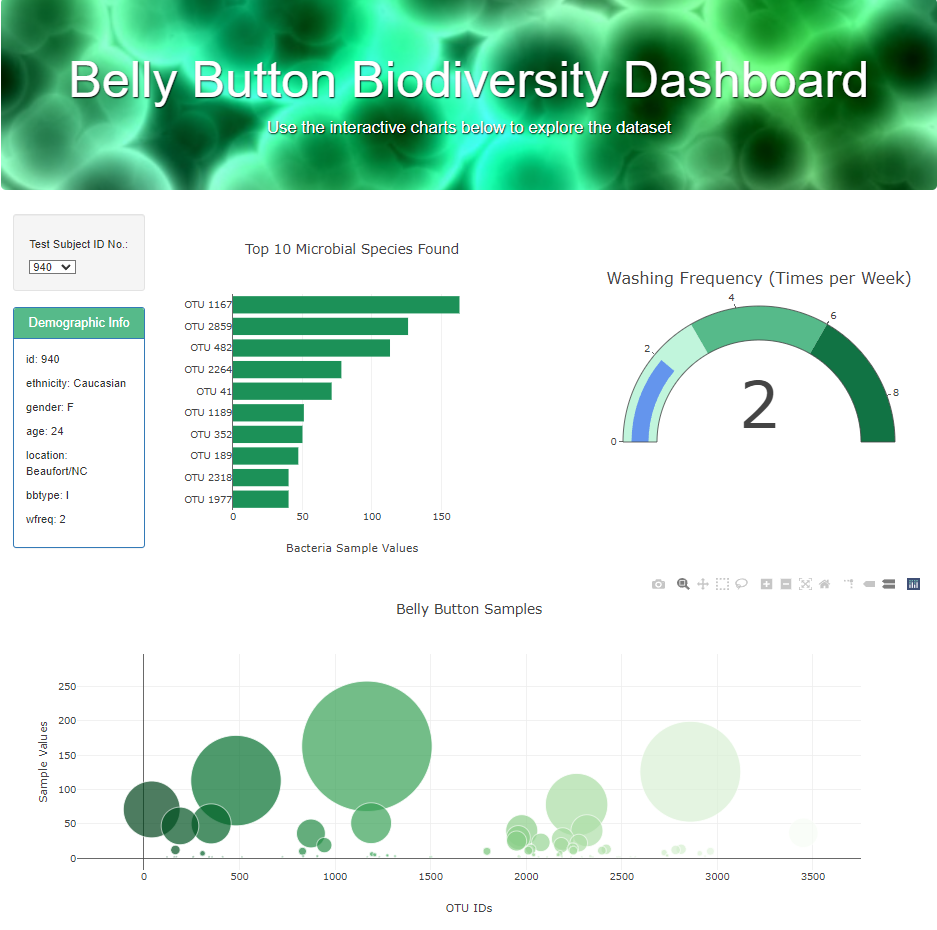

# Belly Button Biodiversity Dashboard

The objective of this assignment was to build an interactive dashboard to explore the Belly Button Biodiversity dataset from the North Carolina State Public Science Lab, which catalogs the microbes that colonize human navels.

This dashboard includes:
- A dropdown list of Test Subject IDs to choose from
- Horizontal bar chart representing the top ten microbial species (OTUS or operational taxonomic units) for the chosen Test Subject ID
- Bubble chart representing the samples taken for the chosen Test Subject ID
- Demographic Information the selected Test Subject ID
- Gauge Chart representing the Test Subject's washing frequency

